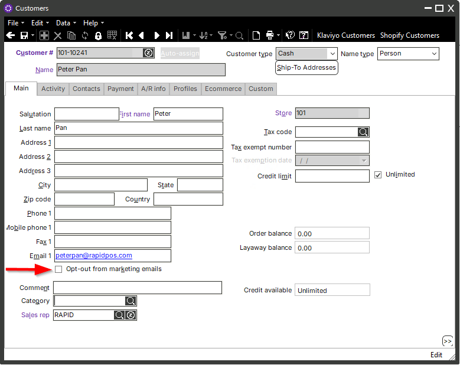
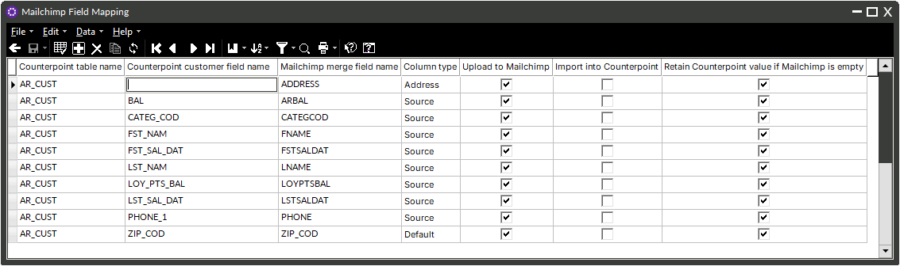
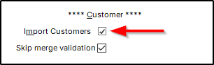
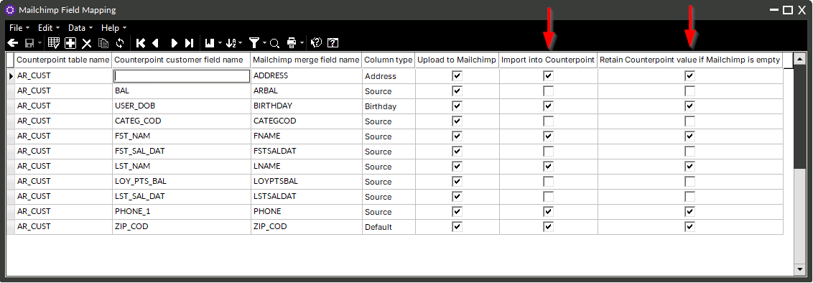
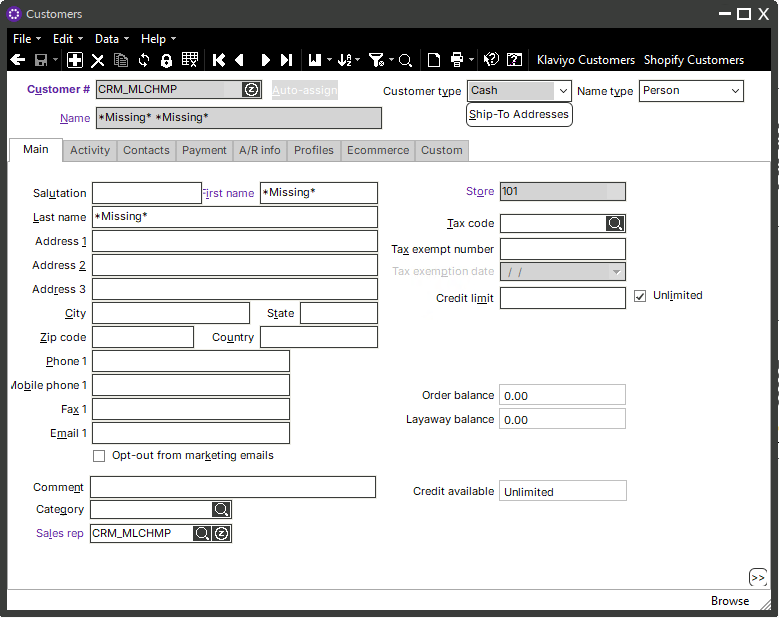
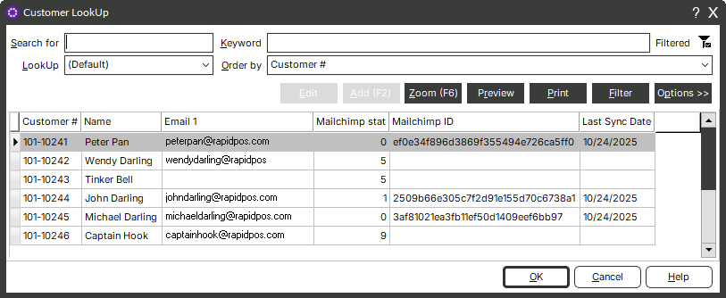
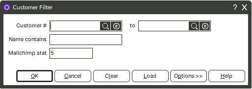
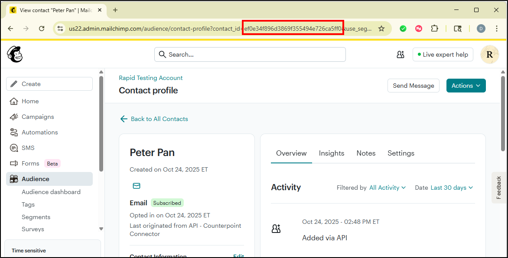
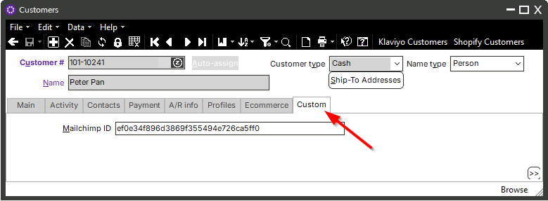

# Rapid POS Mailchimp Connector - Version 3.00.00 - Coming Soon
Updated June 17th 2026

The Rapid Mailchimp Connector automatically syncs customer and sales data from CounterPoint to Mailchimp to support targeted email campaigns and audience segmentation. It can also import new or updated customer information from Mailchimp back into CounterPoint, ensuring both systems stay up to date.

> **Note:** If configured, Phone 1 or Mobile Phone 1 can be included to support Mailchimp SMS Marketing.

---

## Overview

The Rapid Mailchimp Connector keeps your Mailchimp audience in sync with CounterPoint customer and sales data, enabling accurate segmentation, automated flows, and targeted email and SMS campaigns. Customer profiles flow from CounterPoint up to Mailchimp on a 15-minute cycle, and transactional documents sync every minute.

---

## Minimum System Requirements:
- Minimum Counterpoint version: **8.5.6.2**  
- Minimum SQL Server version: **2016**  
- Minimum Supported Operating System version: **Windows Server 2016** or **Windows 11 Pro** 
- Minimum PowerShell version: **5.1**
  

> [!WARNING]
> Your environment must meet our [CI/CD Connector Requirements](https://github.com/Rapid-POS/Miscellaneous-Documents/blob/main/CICD-Connector-Requirements.md) (server access, firewall rules, etc.) before any install or upgrade. Troubleshooting, manual installs, or follow-up work resulting from unmet requirements will be billed at standard T&M rates.

If your system does not meet these minimum requirements, please consult your Care Team Lead (vCIO) for an upgrade quote.

---

## Table of Contents

- [Section 1: Mailchimp Audiences](#section-1-mailchimp-audiences)
- [Section 2: Mailchimp Customer Records](#section-2-mailchimp-customer-records)
- [Section 3: Mailchimp Configuration](#section-3-mailchimp-configuration)
- [Section 4: Mailchimp Field Mapping — Customers Up](#section-4-mailchimp-field-mapping--customers-up)
- [Section 5: Mailchimp Field Mapping — Customers Down](#section-5-mailchimp-field-mapping--customers-down)
- [Section 6: Mailchimp Item Field Mapping & Ticket Information](#section-6-mailchimp-item-field-mapping--ticket-information)
- [Section 7: Mailchimp Tag Mapping](#section-7-mailchimp-tag-mapping)
- [Section 8: Mailchimp Customer Tags](#section-8-mailchimp-customer-tags)
- [Section 9: Mark All Mailchimp Messages as Read](#section-9-mark-all-mailchimp-messages-as-read)
- [Section 10: Run Mailchimp Connector Button](#section-10-run-mailchimp-connector-button)
- [Section 11: Mailchimp Customer Status View](#section-11-mailchimp-customer-status-view)
- [Section 12: Mailchimp Connector Execution and Sync Timing](#section-12-mailchimp-connector-execution-and-sync-timing)
- [Section 13: Customer Profile Sync Logic and Workflow](#section-13-customer-profile-sync-logic-and-workflow)
- [Section 14: Managing Customer Email and Phone Updates](#section-14-managing-customer-email-and-phone-updates)
- [Conclusion](#conclusion)
---

## Section 1: Mailchimp Audiences

The Mailchimp Connector defines how your CounterPoint customer data interacts with Mailchimp. It ensures that your Mailchimp audience and contacts stay updated so that email campaigns always use the most current customer information.

If a client already has an audience set up in Mailchimp, they can choose to use that existing audience for their CounterPoint connection. Mailchimp generally recommends maintaining a **single audience** so that each contact has one unified record. Segmentation — through tags, groups, or segments — can then be used to organize and target contacts within that audience.

If a client does not have an existing audience, the Mailchimp Connector will automatically create one titled **CounterPoint** during setup.

Only the audience defined in the **Mailchimp configuration settings** will receive data from CounterPoint. Information will not sync to any other audiences in the Mailchimp account.

When the same contact (based on email address) exists in multiple audiences, each audience treats that contact as a separate record with its own unique Mailchimp ID. Activity history, tags, merge fields, marketing permissions, and subscription status are tracked independently per audience.

> It is generally recommended to use a single audience to prevent duplicate records; however, some clients have a specific requirement to keep POS contacts separate from others.

---

## Section 2: Mailchimp Customer Records

The Mailchimp Connector adds a **Mailchimp Customers** button within CounterPoint, providing access to Mailchimp-specific customer fields directly from the CounterPoint customer record.


The email address on the Mailchimp customer record is populated from **Email Address 1** on the CounterPoint customer record.
The connector pushes customer records from Counterpoint to Mailchimp **only** when the customer has a valid email address in **Email 1**.

- If the **`Opt-Out of Email Marketing`** checkbox is **unchecked**, the customer is sent to Mailchimp as an **active contact** (subscribed).  
- If the **`Opt-Out of Email Marketing`** checkbox is **checked**, the customer is sent to Mailchimp as an **opted-out contact**, meaning their email address will appear as **unsubscribed** across all Mailchimp lists.

  


Depending on configuration, the SMS phone number is populated from either **Phone 1** or **Mobile Phone 1** on the CounterPoint customer record, only when it meets the following criteria:

- Contains exactly **10 numeric digits**
- Does **not** include letters

If the configured phone number field contains more than or fewer than 10 digits, or if it includes letters, the SMS number will not be pushed to Mailchimp.


### Accessing Mailchimp Customer Records

All Mailchimp customer records can also be accessed from:

**Connectors > Mailchimp > Mailchimp Customer Records**

This view allows records to be displayed in table view, where filters can be applied to review customers based on their current sync status.


### Mailchimp Sync Status Codes

Each Mailchimp customer record includes a sync status value indicating its current state in the sync process:

| Status | Description |
|---|---|
| **0** | Fully synced; nothing pending |
| **1** | Recently created or updated; will sync on the next connector run |
| **2** | Profile is currently in the active sync queue |
| **5** | Invalid email address |
| **6** | Invalid SMS number |
| **9** | Sync error; requires remediation before it can be re-synced |

### Add-on-the-Fly Mailchimp Customer Form (Optional)

An optional Mailchimp Customers Add-on-the-Fly form can be configured to give cashiers limited access to Mailchimp customer records, if desired. Contact Rapid for a quote if you are interested in a customized add-on-the-fly form for your company.

---

## Section 3: Mailchimp Configuration

The Mailchimp Connector includes a user interface for managing configuration options that control how the connector interacts with Mailchimp and CounterPoint. All configuration settings are managed in **CounterPoint > Connectors > Mailchimp > Mailchimp Configuration**.


For clients who use multiple Mailchimp accounts, a separate configuration record will exist for each account.

### Account Name
Identifies the Mailchimp account. Especially important for companies with more than one Mailchimp account (for example, separate accounts for a retail store and a restaurant).

### Is Enabled?
Used to temporarily disable the connector while troubleshooting or testing.

### API Key
Identifies the Mailchimp account and provides the authentication credentials required for the connector to communicate with Mailchimp. Rapid will populate this field during installation.

### Last Sync Date (UTC)
Displays the timestamp of the most recent connector run. This value is automatically updated after each sync and is used to determine which records have changed since the last sync.

### Workgroup ID
Specifies which CounterPoint Workgroup ID is used when creating new customers imported from Mailchimp. A special workgroup is used so that a custom `CRM_MLCHMP` customer template can be applied if needed.

> **Default:** `230` (Mailchimp Connector). This value should typically remain unchanged unless otherwise instructed by Rapid.

### Mailchimp Store ID and Store Name
Each connector instance is associated with a Mailchimp Store ID and Store Name. These settings identify sales data in Mailchimp as coming from CounterPoint as opposed to other sources such as a separate ecommerce integration.

> **Default:** `CounterPoint`. These values typically should not be changed.

### User ID
Defines the CounterPoint User ID assigned to new customers imported from Mailchimp (only if customer import is enabled).

> **Default:** `CRM_MLCHMP`

### Version
Displays the current version of the Mailchimp connector. This field updates automatically when the connector is upgraded and is provided for reference only.

### Customer Lookup Days
Defines the number of days subtracted from the current date when retrieving customer profiles from Mailchimp. This adjustment helps compensate for timezone differences and ensures recently updated customer records are included during synchronization.

### Auto Create Mailchimp Profile
Controls when Mailchimp customer records are automatically created from CounterPoint.

| Setting | Behavior |
|---|---|
| **EMAIL ONLY** | A Mailchimp customer record is automatically created when a customer is added to CounterPoint with Email Address 1. If the configured phone number is also present, it will be included on the profile. |
| **NO** | Mailchimp customer records must be created manually. |
| **BOTH** | A Mailchimp customer record is automatically created only when both Email Address 1 and the configured phone number are present. |

> **Note:** SMS ONLY is currently a placeholder for potential future development. At this time, all customers must have an email address to be synced to Mailchimp.

### Audience ID
Identifies the specific Mailchimp audience to which connector data will sync. The Audience ID is established during setup and should not be modified unless a new audience is being used.

### Insert New Customer Records
Controls whether Mailchimp profiles can create new CounterPoint customer records.

| Setting | Behavior |
|---|---|
| **Checked** | Unmatched Mailchimp profiles will be inserted as new CounterPoint customer records. |
| **Unchecked** | Unmatched Mailchimp profiles will not be inserted as new CounterPoint customer records. |

When checked, customer records are created using fields configured in **Mailchimp Field Mapping – Customers Down** with an Insert action. This option is commonly used when customer data originates from website sign-up forms.

Matching logic uses Mailchimp Profile ID then Email Address 1. If no match is found in either CounterPoint customer records (`AR_CUST`) or Mailchimp customer records (`USER_MAILCHIMP_CUST`), a new CounterPoint customer record is created.

> [!IMPORTANT]
> Importing customers can result in duplicate records if email addresses were not previously captured in CounterPoint. Duplicates can be merged manually but may be especially problematic for clients using DL Scan or 3310 forms. Consult with your Business Analyst, vCIO, or Project Manager before enabling this feature.

### Skip Merge Validation
When clients configure required merge fields in Mailchimp, missing values in CounterPoint cause Mailchimp to reject the sync. Enabling Skip Merge Validation allows the connector to bypass merge field validation and force the customer record to sync, preventing missing fields from blocking synchronization.

### Customer Filter
SQL query configuration used to filter and select customer records for synchronization to Mailchimp.

### Capitalize Customer Fields
Controls automatic capitalization of customer fields during synchronization.

| Setting | Behavior |
|---|---|
| **Checked** | Customer information including names and address fields is automatically converted to uppercase. |
| **Unchecked** | Customer information is synchronized using the original text formatting. |

### Auto Opt-In by Default
Controls whether the opt-in value is automatically selected when creating a new Mailchimp customer record.

| Setting | Behavior |
|---|---|
| **Checked** | The opt-in box is automatically selected when a new Mailchimp customer record is created. |
| **Unchecked** | The opt-in box must be manually selected. |

### Opt-In Definition
Defines the Mailchimp subscription status used when a customer is opted in. Currently the only supported value is `SUBSCRIBED`.

### Opt-Out Definition
Defines the Mailchimp subscription status used when a customer is opted out. Currently the only supported value is `UNSUBSCRIBED`.

### SMS # for Mailchimp
Defines which CounterPoint customer phone number field is used to populate the Mailchimp SMS Number – Mobile Phone profile property. Supported options are `Mobile Phone 1` and `Phone 1`. If the selected field does not contain exactly 10 numeric digits, the phone number will not be sent to Mailchimp.

> This setting determines which phone number is sent to Mailchimp. It does not control SMS subscription consent.

### SMS Country Code
Defines the country code added to SMS phone numbers sent to Mailchimp. Mailchimp requires all SMS phone numbers to include a country code.

| Country | Code |
|---|---|
| United States and Canada | `+1` |
| Mexico | `+52` |

### Send Sales
Controls whether sales data is synchronized from CounterPoint to Mailchimp.

| Setting | Behavior |
|---|---|
| **Checked** | Sales data is sent from CounterPoint to Mailchimp. |
| **Unchecked** | Only customer data is synchronized. |

### Start Date Days
Defines how many days of historical sales data should be pushed during the initial sync. The default value is **-60 days**, meaning sales from the past 60 days will be pushed to Mailchimp during the first sync. This value can be adjusted as needed.

### Product Category, Subcategory, and Vendor Type
Mailchimp provides only a single product category field. Rapid developed a workaround that combines category, subcategory, and vendor into this single field to enhance reporting and segmentation.

**Example of combined values:**

| Field | Description | Code |
|---|---|---|
| Category | Fruits & Vegetables | `FRUIT&VEG` |
| Subcategory | Tropical Fruits | `TROPFRUITS` |
| Vendor | Golden Grove Company | `GOLDENGROVE` |

When combined and sent as description: `Fruits & Vegetables/Tropical Fruits/Golden Grove Company`


When combined and sent as code: `FRUIT&VEG/TROPFRUITS/GOLDENGROVE`


When configuring this setting, consider how segments will be created in Mailchimp. For specific filtering (e.g., Category **equals** Tropical Fruits), sending a single data type produces the most precise results. 


For broader filtering (e.g., Category **contains** "Fruit"), combined values may all contribute to the match.


### Internal Configuration Options
Additional internal configuration options exist for use by programmers to optimize performance or assist with troubleshooting. These values should not be adjusted by end users.

---

## Section 4: Mailchimp Field Mapping — Customers Up

The Mailchimp Field Mapping – Customers Up screen provides a user interface for managing which customer fields are sent from CounterPoint up to Mailchimp. This table defines how customer profile data in CounterPoint maps to Mailchimp profile properties. The standard deployment includes a predefined set of fields. Adjustments to this table should generally be performed by a programmer.


> **Note:** Email Address 1 is a required field and must be sent to Mailchimp.

### Mailchimp Field Mapping

It is important to distinguish between **customer** information and information related to **tickets** or **items**. Mailchimp accepts a wide range of customer data but supports only limited ticket and item information.

For sycning customer information, the Mailchimp connector uses **custom field mapping**, allowing nearly any field from the Counterpoint customer record to be sent to Mailchimp. Customer merge fields and their mappings are displayed in **Counterpoint > Connectors > Mailchimp > Mailchimp Field Mapping**.  

This screen shows which Counterpoint fields populate Mailchimp merge fields and how each is mapped. To adjust field mappings, consult with Rapid.

  

### Standard Customer Profile Fields Sent to Mailchimp

The following customer fields are included in a standard Mailchimp connector deployment:

1. Email Address 1 *(required and hard-coded; not included in the mapping table)*
2. SMS *(if SMS is configured; hard-coded; not included in the mapping table)*
3. Customer Number *(strongly recommended; must use merge field column type = default)*
4. First Name
5. Last Name
6. Full Address *(Address + City + State + Zip)*
7. Zip Code *(must use merge field column type = default)*
8. Phone 1
9. Customer Category
10. First Sale Date
11. Last Sale Date
12. Loyalty Point Balance
13. A/R Account Balance

### Addresses

Mailchimp requires the full customer address to be combined into a single field with a column type of `address`. Address 1, Address 2, Address 3, City, State, and Zip Code are merged and sent as one field. If you would like to send these fields individually for segmentation, they can also be configured as separate custom fields.

When importing customer address information into Counterpoint, ensure that the merge field column type is set to `address`. Mailchimp will then separate each address component for proper import into Counterpoint.

### Birthdays

If birthday information is stored in CounterPoint, it can be sent to Mailchimp as a custom field with the merge field column type set to `birthday`. Mailchimp accepts only month and day — not the year — so the connector removes the year before sending. When importing customers from Mailchimp, birthdays are imported into CounterPoint as MM/DD/1900, because CounterPoint requires a year for date fields.

### Calculated Fields

Calculated fields can also be sent to Mailchimp in some cases. These requests are reviewed and quoted individually by Rapid programmers. An example is the date a customer last purchased a product in a specific category.

---

## Section 5: Mailchimp Field Mapping — Customers Down

The Mailchimp Field Mapping – Customers Down table provides a user interface for managing which customer fields are imported from Mailchimp down into CounterPoint. For clients using web-based sign-up forms or other Mailchimp integrations, this functionality allows customer data entered in Mailchimp to be imported into CounterPoint, including updating existing fields or inserting new customer records.


### Default Behavior

In a standard deployment, no fields are imported from Mailchimp. All fields in the table are set to **No Action** by default. Any change to this behavior must be requested by the client and configured by a programmer.

### Action Types

| Action | Behavior |
|---|---|
| **Insert Only** | The field is set by Mailchimp only when a new CounterPoint customer record is created. |
| **Update Existing** | The field is updated in CounterPoint when the value changes in Mailchimp. Does not apply during new customer creation. |
| **Insert and Update** | The field is set on new customer creation and updated when the value changes in Mailchimp. |
| **No Action** | The field is not set or updated by Mailchimp in CounterPoint. |

> The two action types that include Insert only function when **Insert New Customer Records** is enabled. The two action types that include Update function regardless of that setting. Use caution when selecting which Mailchimp fields are allowed to overwrite CounterPoint data. Consult with your Business Analyst before enabling field updates.

### Retain CounterPoint Value if Mailchimp is Empty

| Setting | Behavior |
|---|---|
| **Checked** | CounterPoint will not be updated with blank values from Mailchimp. Recommended to prevent web sign-up forms from overwriting existing data. |
| **Unchecked** | Allows existing CounterPoint values to be overwritten with blank values from Mailchimp. Not recommended. |

The connector can be configured to import customers from Mailchimp into Counterpoint.  

 

This feature is especially useful for automatically creating customer records in Counterpoint when users sign up through a **website form** or other Mailchimp-integrated source.

### Limitations

The connector will **only import contacts** who belong to the **configured audience** in Mailchimp. Contacts outside of that audience will not be imported into Counterpoint.

### Caution Regarding Duplicate Customers

If email addresses were not previously captured in Counterpoint, the connector has no way to match existing Counterpoint records with those imported from Mailchimp.  

In this situation, **duplicate customer records** may be created. When duplicates are discovered, they can be manually merged using Counterpoint’s **Merge Customer Utility**.

This issue is particularly important for clients who use **Driver License (DL) Scan** or clients who have to track sales by customer in a given time period (such as with firearm sales).  

Consult with your **Business Analyst (BA)**, **Care Team**, or **Project Manager** before enabling this functionality—especially if DL Scan is in use.

### Determining Which Fields to Import

Carefully review and select the fields to import from Mailchimp into Counterpoint. Each field can be configured individually in the **Mailchimp Field Mapping** user interface. 

For best results, always enable the flag `Retain Counterpoint Value if Mailchimp is Empty`.
- This setting prevents overwriting existing data in Counterpoint with blank or missing values from Mailchimp.
- For example, if `Phone 1` is populated in Counterpoint but empty in Mailchimp, the existing phone number will be preserved during import.

 

### Using the Template Customer

By default, the workgroup 230 template customer record is set to `CRM_MLCHMP` and configured with **First Name** and **Last Name** values set to `*MISSING*`.

This ensures that if these values are not provided in the Mailchimp contact, the connector will still import the email address and create the customer record in Counterpoint.  

These imported customers can later be filtered and updated with correct names as needed.

 

When `Skip Merge Validation` is **not** enabled in the configuration, these predefined `*MISSING*` values can also be sent back to Mailchimp to populate required fields that would otherwise prevent synchronization.
- Note: Using Skip Merge Validation is highly recommended. 

### First and Last Name vs. Business/Company Name

When importing data from Mailchimp, if an existing customer record in Counterpoint is designated as a **Business** (name type = Business), the **First Name** and **Last Name** fields from Mailchimp will **not update/overwrite** the existing **business name** in Counterpoint.  

This protects business names from being replaced with individual name data during the import process.


---

## Section 6: Mailchimp Item Field Mapping & Ticket Information

### Mailchimp Item Field Mapping

Item field mapping defines how CounterPoint item values are sent to Mailchimp product fields. The item fields sent to Mailchimp are configurable, allowing different CounterPoint item fields to be mapped to Mailchimp product attributes such as item ID, title, description, type, and URL.


Because Mailchimp does not provide dedicated fields for CounterPoint POS ticket data, the connector sends ticket information using Mailchimp's Ecommerce fields.

### Ticket Header / Overall

- Order Total
- Tax

### Ticket Lines

- Item Number
- Item Description
- Quantity Purchased
- Price

### Items
- Item Number  
- Item Description _(Product Title)_
- Item Category _(Can include combined values for Category + Subcategory + Vendor based on configuration options)_

### Additional Customer Data

- Total Number of Tickets for that customer
- Total Spent

Only **posted tickets** are sent to Mailchimp. When a drawer is posted, the associated tickets are pushed to Mailchimp. During connector installation, previous sales history can be included in the initial sync — for example, sales from the previous 60, 180, or 365 days.

> **Note:** The Mailchimp connector supports a custom configuration that combines category, subcategory, and vendor details from CounterPoint into Mailchimp's single product category field. Refer to [Section 3: Mailchimp Configuration](#section-3-mailchimp-configuration) for details.

---
### Mailchimp Customer Tags

Mailchimp tags are simple labels that help organize and group contacts within an audience. Tags can be used to identify customers who meet specific criteria, such as earning a particular number of loyalty points or reaching a defined spending threshold.    

Once a tag is applied to a contact, it can be used in Mailchimp to:  

- Send campaigns directly to tagged contacts  
- Build segments based on tags  
- Trigger automated journeys when a tag is added  

## Section 7: Mailchimp Tag Mapping

The Mailchimp connector can automatically apply tags based on customer information stored in CounterPoint. During each sync, the connector evaluates each customer and determines which tags should apply based on a custom condition filter created for that specific rule.

Examples of tagging criteria include:

- Assigning a tag to customers with more than 100 loyalty points
- Assigning a tag to customers whose total spending exceeds $1,000

Once tagging criteria are defined, Rapid will review the requirements and provide a quote. After approval, a programmer will create the condition filter and add it to the Mailchimp Tag Mapping table.


Each condition filter checks the customer's data in CounterPoint and evaluates whether the defined criteria are met. When the condition is satisfied, the connector applies the corresponding tag in Mailchimp.

**Example condition filter for sales over $1,000:**

```sql
SELECT TOP 1 1 FROM AR_CUST I (NOLOCK)
WHERE I.CUST_NO = '@CUST_NO'
AND EXISTS (
  SELECT H.CUST_NO, SUM(SUB_TOT) SUB_TOT
  FROM PS_TKT_HIST (NOLOCK) H
  WHERE I.CUST_NO = H.CUST_NO
  GROUP BY H.CUST_NO
  HAVING SUM(SUB_TOT) > 1000
)
```


Once applied, tags become available in Mailchimp and can be used for segmentation or automations. For example, a tag such as **Sales > $1,000** could be used to trigger a VIP automation in Mailchimp.


Multiple automated tags may be configured. Viewing the Mailchimp Tag Mapping table in table view displays the full list of configured tag rules:


---

## Section 8: Mailchimp Customer Tags

When a customer qualifies for a new tag, a record is created in the **Mailchimp Customer Tags** table. This table displays tags waiting to be synced, and each record remains visible until it is processed by the connector.


### Tag Removal

The connector pushes tags from CounterPoint into Mailchimp but does **not** remove tags. However, Mailchimp automations can be used to remove outdated tags.

For example, consider a tagging structure based on loyalty point tiers:

- **Loyalty Points Less than 100**
- **Loyalty Points 100** (100–199 points)
- **Loyalty Points 200** (200–299 points)
- **Loyalty Points 300** (300+ points)

If a customer's point balance changes and they move into a different tier, older tags may need to be removed. Mailchimp automations can be configured to remove tags when a new tier-based tag is applied.

The example below shows how tags for levels 300, 200, and less than 100 are automatically removed when a customer receives the 100-level tag:


> Contact Rapid for assistance in defining tagging criteria or to request a quote for creating custom condition filters.

---

## Section 9: Mark All Mailchimp Messages as Read

The **Mark All Mailchimp Messages as Read** menu option allows users to suppress repeated pop-up alerts in CounterPoint while retaining all Mailchimp connector messages for later review.

This is especially useful in scenarios such as repeated error messages following a temporary internet outage, or high-volume alert conditions that have already been reviewed.

Marking messages as read stops the pop-up notifications but does **not** delete the messages. All connector messages remain accessible in CounterPoint and can be reviewed at any time.

---

## Section 10: Run Mailchimp Connector Button

The Mailchimp Connector runs automatically every **15 minutes** to keep customer data synchronized between Counterpoint and Mailchimp.
The **Run Mailchimp Connector** menu option allows authorized users to manually trigger the Mailchimp Connector when needed. Manual execution is typically used for testing or troubleshooting and is not required during normal operation.

### How Manual Execution Works

When the Run Mailchimp Connector menu option is selected:

- A **Manual Run Connector** action flag is set in the Mailchimp configuration.
- The flag functions as a one-time execution request and remains enabled until it is processed by the connector.
- Execution is handled in the background on the server, not on the workstation, to prevent overlapping executions.

### Background Processing and Scheduling

A background process periodically checks for the Manual Run Connector action flag based on a configurable CRON schedule stored in the Mailchimp configuration.

- If the Mailchimp connector is **not currently running**, it will execute for all configured Mailchimp accounts, typically within one minute.
- If the connector **is already running**, the system waits for the current execution to complete, then automatically restarts for all configured accounts.

In both scenarios, the action flag is automatically cleared when execution begins.

> **Important:** Manual execution is intended primarily for programmer-led testing or troubleshooting, often when the connector has been temporarily disabled. It is not designed for routine operational use, as the connector runs automatically according to its configured schedule.

---

## Section 11: Mailchimp Customer Status View

Each Mailchimp customer record includes a sync status that indicates its current state in the connector process. The **Mailchimp Customer Status View** displays a summary table showing each sync status code and the total number of customer records currently associated with that status.

For example, you may want to identify that 43 customers have an invalid email address (status 5) so those records can be reviewed and corrected.

**Notes:**

- If no customer records exist for a given status, that status will not appear in the table.
- The table can be refreshed at any time to display the most up-to-date information.
- This is best viewed in table view.


For details on the meaning of each sync status value, refer to [Section 2: Mailchimp Customer Records](#section-2-mailchimp-customer-records).

### Viewing Sync Status in Counterpoint

To view a customer’s sync status:

1. Open the **Customer Lookup** screen in Counterpoint.  
2. Use the **Column Designer** to add the `Mailchimp Stat` column. This column displays the current sync status value for each customer.

  

### Filtering by Sync Status

The **Customer Lookup** screen can also be filtered to display only customers with a specific Mailchimp status code.  

This allows for quick identification and remediation of records that are queued, invalid, or have encountered sync errors.

  

### Comparing Mailchimp ID

The contact profile Mailchimp ID is part of the profile's URL. This can be compared to the Mailchimp ID stored on the custom tab of the customer record in Counterpoint (and can be manually adjusted if necessary). 

  

  

---

## Section 12: Mailchimp Connector Execution and Sync Timing

The Mailchimp Connector operates as a Windows Service, automatically syncing customer profiles and transactional documents between CounterPoint and Mailchimp. The connector runs continuously in the background and is responsible for keeping both systems aligned while respecting Mailchimp API rate limits and configured sync rules.

### Sync Intervals

| Data Type | Interval |
|---|---|
| Customer Profiles | Every 15 minutes |
| Documents in the Queue | Every 1 minute *(configurable to prevent rate limiting)* |

If a document being synced contains a new customer, the customer profile is created in Mailchimp immediately as part of the document sync. The connector does not wait for the next 15-minute customer profile sync cycle.

---

## Section 13: Customer Profile Sync Logic and Workflow

The Mailchimp Connector processes customer profile updates in a defined sequence to ensure that the most recent and authoritative data is preserved between CounterPoint and Mailchimp.

### Step 1: Sync Changes from Mailchimp Down to CounterPoint

The connector first retrieves profile changes made in Mailchimp and evaluates whether those changes should be applied to CounterPoint. It compares the date and time of the most recent profile change in Mailchimp to the most recent update in CounterPoint, and uses the values from the source with the most recent timestamp.

- If **Insert/Update Customers** is enabled, all configured fields are synced down from Mailchimp to CounterPoint.
- If **Insert/Update Customers** is disabled, only subscription status changes are synced down.

### Step 2: Sync Changes from CounterPoint Up to Mailchimp

After processing inbound changes, the connector identifies customer records in CounterPoint that have been created or modified since the previous sync and pushes those updates up to Mailchimp, ensuring Mailchimp profiles reflect the most current customer information stored in CounterPoint.

---

## Section 14: Managing Customer Email and Phone Updates

When a customer is synced to Mailchimp, the connector stores the associated **Mailchimp Profile ID** on the customer record in CounterPoint. This Profile ID becomes the permanent link between the CounterPoint customer and the Mailchimp profile and is used for all future updates. Using the Profile ID ensures that customer history, engagement data, and flow activity are preserved in Mailchimp even when identifying information changes.

### Updating Email Address and Phone Number

If Email Address 1 or the configured phone number is updated in CounterPoint for a customer who already has a Mailchimp profile:

- The connector updates the email address or phone number on the **existing Mailchimp Profile ID**.
- A new Mailchimp profile is **not** created.
- The customer retains their full Mailchimp history, including events, metrics, and flow participation.

### Handling Duplicate Customer Records

Because Mailchimp profiles are uniquely identified by email address per Mailchimp account, a single email address can only be associated with one CounterPoint customer record for that account.

**Scenario 1: Duplicate email addresses already exist in CounterPoint during initial setup**

If multiple CounterPoint customers already share the same Email Address 1 when the connector is installed, the connector creates or associates one Mailchimp profile for that email address. Only one CounterPoint customer record can be linked to that profile. Any additional CounterPoint customers using the same email address will not be able to create or associate their own Mailchimp customer record.

**Scenario 2: A Mailchimp customer record already exists and the same email is assigned to another CounterPoint customer**

If a user attempts to assign an email address that is already linked to a Mailchimp customer record to a different CounterPoint customer record, CounterPoint blocks the action and returns an error. The connector does not allow a second CounterPoint customer to be linked to the same Mailchimp profile.

### Handling Merged Customers in CounterPoint

When two customer records are merged in CounterPoint:

- The Mailchimp customer record associated with the **"To"** customer (the retained record) remains linked to the Mailchimp profile.
- If the **"From"** customer had an associated Mailchimp customer record, that record becomes detached from any active customer.

It is recommended to manually delete the detached Mailchimp customer record after the merge. Otherwise, it will remain in CounterPoint with no functional association to an active Mailchimp profile.

---

## Conclusion

The Rapid Mailchimp Connector streamlines the exchange of customer profiles and transactional data between CounterPoint and Mailchimp, enabling powerful email and SMS marketing, accurate segmentation, and automated flows.

Before go-live, review configuration settings, field mappings, and audience configurations to ensure customer data and subscription preferences are handled correctly. After deployment, monitor customer and document sync status views to identify invalid data or records requiring remediation.

For assistance with configuration changes, custom field mapping, tag setup, or troubleshooting, contact Rapid Support.


