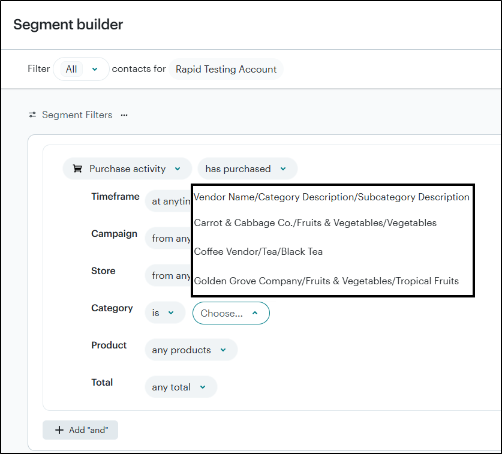
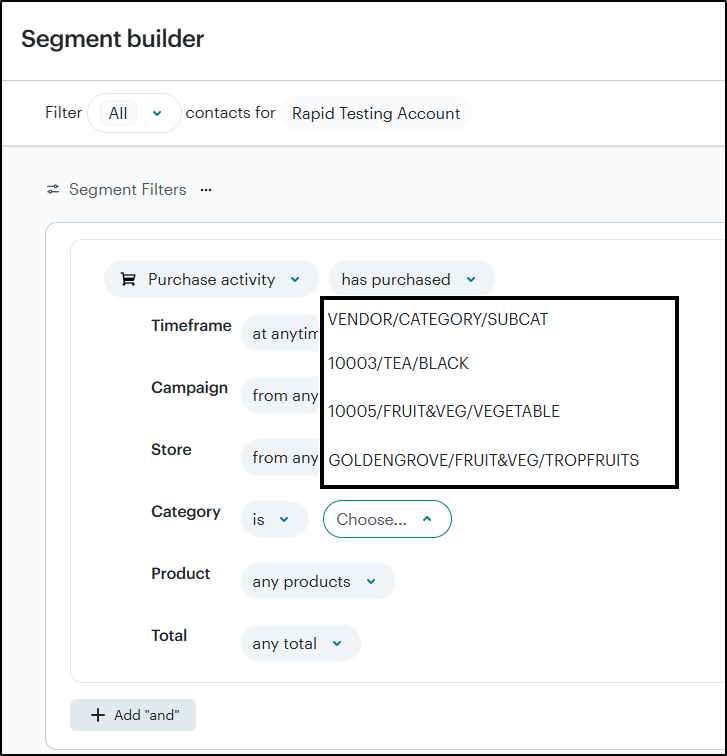
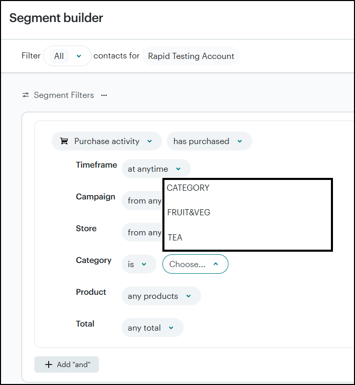
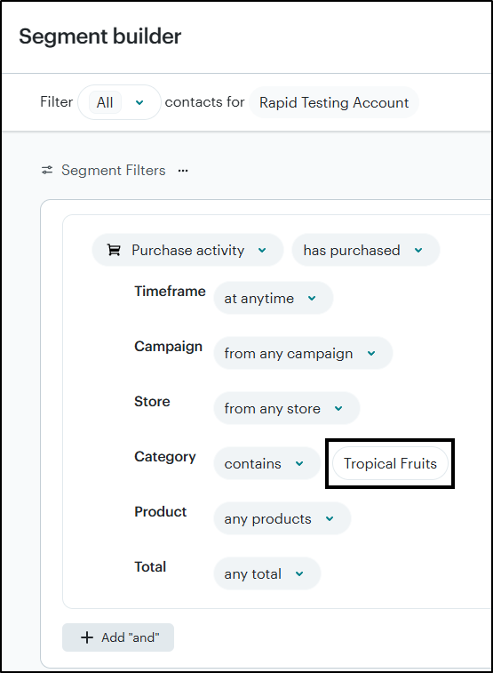

# Rapid POS Mailchimp Connector - Version 2.1 
## *(Version 2.2 coming soon!)*
Updated 11/13/2025

---

## Overview

The Rapid Mailchimp Connector automatically syncs customer and sales data from Counterpoint to Mailchimp to support targeted email campaigns and audience segmentation. It can also import new or updated customer information from Mailchimp back into Counterpoint, ensuring both systems stay up to date.

---

## Minimum System Requirements:
- Minimum Counterpoint version: **8.5.6.2**
- Minimum SQL Server version: **2016**

If you would like the Mailchimp connector but your system does not meet these minimum requirements, please consult your Care Team Lead (vCIO) for an upgrade quote.

---

## Table of Contents

- [Minimum System Requirements](#minimum-system-requirements)
- [Section 1: Mailchimp Audiences and Contacts](#section-1-mailchimp-audiences-and-contacts)
- [Section 2: Customer Information](#section-2-customer-information)
- [Section 3: Ticket & Item Information](#section-3-ticket--item-information)
- Coming soon! Mailchimp Customer Tags
- [Section 4: Connector Sync Process](#section-4-connector-sync-process)
- [Section 5: Common Customer Sync Questions](#section-5-common-customer-sync-questions)
- [Section 6: Troubleshooting and Sync Status Codes](#section-6-troubleshooting-and-sync-status-codes)
- [Section 7: Importing Customers from Mailchimp into Counterpoint](#section-7-importing-customers-from-mailchimp-into-counterpoint)
- [Section 8: Configuration](#section-8-configuration)
- [Section 9: Additional Mailchimp Tools](#section-9-additional-mailchimp-tools)
- [Conclusion](#conclusion)

---

## SECTION 1: Mailchimp Audiences and Contacts

The Mailchimp Connector defines how your Counterpoint customer data interacts with Mailchimp. It ensures that your Mailchimp audience and contacts stay updated so that email campaigns always use the most current customer information.

### Audience

If a client already has an audience set up in Mailchimp, they can choose to use that existing audience for their Counterpoint connection.  
- Mailchimp generally recommends maintaining **a single audience** so that each contact has one unified record.
- Segmentation — through **tags, groups, or segments** — can then be used to organize and target contacts within that audience.

If a client does not have an existing audience to use, the Mailchimp Connector will automatically create one titled **Counterpoint** during setup.

Only the audience defined in the **Mailchimp configuration settings** will receive data from Counterpoint. Information will not sync to any other audiences in the Mailchimp account.

In Mailchimp, when the same contact (based on email address) exists in multiple audiences, each audience treats that contact as a **separate record**.  
- Each record receives a unique **Mailchimp ID** within its respective audience.  
- The contact’s activity history, tags, merge fields, marketing permissions, and subscription status are tracked independently for each audience.

It is generally recommended to use a single audience to prevent duplicate records; however, sometimes clients have a specific requirement to keep POS contacts separate from others. 

### Contacts

The connector pushes customer records from Counterpoint to Mailchimp **only** when the customer has a valid email address in **Email 1**.

- If the **`Opt-Out of Email Marketing`** checkbox is **unchecked**, the customer is sent to Mailchimp as an **active contact** (subscribed).  
- If the **`Opt-Out of Email Marketing`** checkbox is **checked**, the customer is sent to Mailchimp as an **opted-out contact**, meaning their email address will appear as **unsubscribed** across all Mailchimp lists.

  

---

## SECTION 2: Customer Information & Mailchimp Field Mapping

It is important to distinguish between **customer** information and information related to **tickets** or **items**. Mailchimp accepts a wide range of customer data but supports only limited ticket and item information.

For sycning customer information, the Mailchimp connector uses **custom field mapping**, allowing nearly any field from the Counterpoint customer record to be sent to Mailchimp. Customer merge fields and their mappings are displayed in **Counterpoint > Connectors > Mailchimp > Mailchimp Field Mapping**.  

  

This screen shows which Counterpoint fields populate Mailchimp merge fields and how each is mapped. To adjust field mappings, consult with Rapid.

  

### Below are _examples_ of customer details that can be sent to Mailchimp:

1. Email 1 _(Required and hard-coded, not included in the mapping table)_
2. Customer Number *  _(Strongly recommended)_
3. First Name  
4. Last Name  
5. Full Address _(Address + City + State + Zip)_  
6. Zip Code *  
7. Phone 1 
8. Customer Category  
9. First Sale Date  
10. Last Sale Date  
11. Loyalty Point Balance  
12. A/R Account Balance

\* Must be sent as **merge field column type = default.**

### Keep the following points in mind:

#### Addresses

Mailchimp requires the **full customer address** to be combined into a single field with a column type of `address`. Accordingly, **Address 1**, **Address 2**, **Address 3**, **City**, **State**, and **Zip Code** are merged and sent to Mailchimp as one field.

If you would like to send these fields individually (for example, **Zip Code** for audience segmentation), you can also configure them as separate custom fields.

When importing customer address information into Counterpoint, ensure that the merge field column type is set to `address`. Mailchimp will then separate each address component for proper import into Counterpoint.

#### Birthdays

If birthday information is stored in Counterpoint, it can be sent to Mailchimp as a custom field with the merge field column type set to `birthday`.  

Mailchimp only accepts **month and day** — not the year — so the connector removes the year before sending the data.

When importing customers from Mailchimp, birthdays are imported into Counterpoint as MM/DD/1900.  
- The year **1900** is added automatically because Mailchimp omits the year, but Counterpoint requires it for date fields.

#### Calculated Fields

In some cases, **calculated fields** can also be sent to Mailchimp. These requests are reviewed and quoted individually by Rapid programmers.

Example of a calculated field:
- The date a customer last purchased a product in a specific category.  

---

## SECTION 3: Ticket & Item Information

Mailchimp accepts a limited amount of customer sales information. Ticket data is sent to Mailchimp’s **Ecommerce** fields, as Mailchimp does not provide dedicated fields for POS data.

### Ticket Header / Overall
- Order Total  
- Tax

### Ticket Lines
- Item Number  
- Item Description 
- Quantity Purchased  
- Price

### Items
- Item Number  
- Item Description _(Product Title)_
- Item Category _(Can include combined values for Category + Subcategory + Vendor based on configuration options)_

### Additional Customer Data
- Total Number of Tickets for that customer  
- Total Spent

While Mailchimp supports **custom merge field mapping** for customer information, it **does not** support custom mapping for items. Only the values listed above can be sent.

Only **posted tickets** are sent to Mailchimp. When a drawer is posted, the associated tickets are pushed to Mailchimp.

If desired, during connector installation, previous sales history can be included during the initial sync. For example, you can choose to send sales data from the previous 60, 180, or 365 days.

### Special Note on Mailchimp's Product Category Field
The Mailchimp connector supports a custom configuration that combines **category**, **subcategory**, and **vendor** details from Counterpoint into Mailchimp’s single `product category` field (formerly the `product vendor` field). Review the configuration section of this document to learn more about this functionality.

---

## Coming soon! Mailchimp Customer Tags

Mailchimp tags are simple labels that help organize and group contacts within an audience. Tags can be used to identify customers who meet specific criteria, such as earning a particular number of loyalty points or reaching a defined spending threshold.    

Once a tag is applied to a contact, it can be used in Mailchimp to:  

- Send campaigns directly to tagged contacts  
- Build segments based on tags  
- Trigger automated journeys when a tag is added  

### Mailchimp Tag Mapping

The Mailchimp connector can automatically apply tags based on customer information stored in Counterpoint. During each sync, the connector evaluates each customer and determines which tags should apply based on a **custom condition filter** created for that specific rule.  

Examples of tagging criteria include:

- Assigning a tag to customers with more than 100 loyalty points  
- Assigning a tag to customers whose total spending exceeds $1,000 

Once the tagging criteria are defined, Rapid will review the requirements and provide a quote. After approval, a programmer will create the condition filter and add it to the Mailchimp Tag Mapping table.  

Each condition filter checks the customer’s data in Counterpoint and evaluates whether the defined criteria are met. When the condition is satisfied, the connector applies the corresponding tag in Mailchimp. Each automated tag requires its own condition filter, written according to the rules provided for that tag. For example: 

SELECT TOP 1 1 FROM AR_CUST I (NOLOCK) WHERE I.CUST_NO = '@CUST_NO' AND EXISTS (SELECT H.CUST_NO, SUM(SUB_TOT) SUB_TOT FROM PS_TKT_HIST (NOLOCK) H WHERE I.CUST_NO = H.CUST_NO GROUP BY H.CUST_NO HAVING SUM(SUB_TOT) > 1000)

Once applied, tags become available in Mailchimp audience and can be used for segmentation or automations. For example, a tag such as **Sales > $1,000** could be used to trigger a VIP automation in Mailchimp.

 

 

Multiple automated tags may be configured. Viewing the Mailchimp Tag Mapping table in table view displays the full list of configured tag rules:

### Mailchimp Customer Tags

When a customer qualifies for a new tag, a record is created in the **Mailchimp Customer Tags** table. This table displays tags waiting to be synced, and each record remains visible until it is processed by the connector.

### Tag Removal

The connector pushes tags **from Counterpoint into Mailchimp**, but does **not** remove tags. However, Mailchimp automations can be used to remove outdated tags.

For example, consider a tagging structure based on loyalty point tiers:

- **Loyalty Points 100** (100–199 points)  
- **Loyalty Points 200** (200–299 points)  
- **Loyalty Points 300** (300+ points)  

If a customer’s point balance changes and they move into a different tier, older tags may need to be removed. This can be managed with Mailchimp automations that remove tags when a new tier-based tag is applied.

The example below shows how tags for levels 300 and 200 are automatically removed when a customer receives the 100-level tag:

### Configuring Mailchimp Tag Mapping

Please contact Rapid for assistance in defining tagging criteria or if a quote is needed for creating custom condition filters.

---

## SECTION 4: Connector Sync Process

The Mailchimp Connector runs automatically every **15 minutes** to keep customer data synchronized between Counterpoint and Mailchimp.

### Step 1: Update Unsubscribed Contacts

The connector first retrieves every contact marked as **unsubscribed** in Mailchimp and sets the corresponding customer **opt-out flag** in Counterpoint.  

This ensures that Mailchimp unsubscribes always take precedence, maintaining compliance with customer email preferences across both systems.

### Step 2: Compare Subscription Status Changes

Next, the connector retrieves a list of contacts in Mailchimp who have changed their subscription status — either **opted-in** or **opted-out** — since the last sync.  

It then compares the **date and time** of each contact change in Mailchimp with the corresponding customer opt-in/out timestamp in Counterpoint.

- If the customer was opted-out by a user in Counterpoint, they can be re-added to Mailchimp by unchecking the **“Opt-out from marketing emails”** flag in Counterpoint.  
- If the customer unsubscribed via a Mailchimp link (for example, using the unsubscribe link in an email), Mailchimp will **not allow a resubscribe** initiated from Counterpoint.  
  In this case, the `Opt-out from marketing emails` flag in Counterpoint will automatically be reset to **opted-out** during the next connector run.

### Step 3: Sync *Updated and New* Customers *to* Mailchimp

After processing subscription changes, the connector identifies all customers in Counterpoint who have been **added or modified** since the previous sync.  

These records are pushed to Mailchimp, ensuring that existing Mailchimp contact information is updated with the latest data from Counterpoint.

### Step 4: (Optional) Import *Updated and New* Customers *from* Mailchimp

If enabled in your configuration, the connector can also **download customer updates** from Mailchimp into Counterpoint. This includes customers who have added or modified their information through a **website form**, **sign-up form**, or any other Mailchimp integration.

- **New contacts** in Mailchimp are automatically matched or created in Counterpoint based on the **email address**.  
- Changes to **existing contacts** in Mailchimp are updated in Counterpoint by matching on their **Mailchimp ID**.

---

## SECTION 5: Common Customer Sync Questions

Occasionally, two customers in Counterpoint may share the same email address, or a customer’s email address may be updated. The following explains how the connector handles various situations.

### Multiple Customers with the Same Email Address

When multiple customers share the same email address in Counterpoint, the connector prioritizes the customer who has already been synced to Mailchimp (the one with an existing **Mailchimp ID**).  

The user will receive a message in Counterpoint indicating that the customer **without** a Mailchimp ID could not be synced due to the duplicate email address.

If none of the customers have a Mailchimp ID yet, the connector will sync the customer with the **most recent last sale date** and skip the other customer record(s).

### Merging Customer Records in Counterpoint

When a user determines that two customer records in Counterpoint represent the same individual or business, those records can be merged into a single customer.
  
If both customers have previously been synced to Mailchimp, each record will already have its own **Mailchimp ID**.

During the merge process, the **Mailchimp ID** associated with the “**To**” customer (the record being kept) is **retained**, while the **Mailchimp ID** from the “**From**” customer (the record being merged) is **discarded**.  

After the merge, the connector continues to sync using the retained Mailchimp ID.

### Updating an Existing Customer’s Email Address

When a customer who has already been synced to Mailchimp updates their email address in Counterpoint, the connector automatically updates the corresponding Mailchimp contact based on the stored **Mailchimp ID**. This ensures the customer’s information is preserved in Mailchimp while simply replacing the old email address with the new one.

However, if the newly entered email address in Counterpoint already exists in Mailchimp under a different contact, Mailchimp will prevent the update. **In this case, an error message will appear in the Counterpoint message center, and the email address for that Mailchimp profile will remain unchanged.**

---

## SECTION 6: Troubleshooting and Sync Status Codes

If a customer record is not syncing to Mailchimp, it is important to check their **Mailchimp Sync Status** in Counterpoint.  

The sync status value indicates the current state of the customer’s record in the Mailchimp connector process.

### Sync Status Codes

| **Sync Status** | **Description** |
|------------------|-----------------|
| **0** | Customer has been synced to Mailchimp. |
| **1** | Customer will be added to the sync queue during the next connector run. |
| **2** | Customer is currently in the active sync queue. |
| **5** | Customer has an invalid email address as determined by Mailchimp. |
| **9** | Customer encountered an error during syncing and requires investigation. |

### Viewing Sync Status in Counterpoint

To view a customer’s sync status:

1. Open the **Customer Lookup** screen in Counterpoint.  
2. Use the **Column Designer** to add the `Mailchimp Stat` column. This column displays the current sync status value for each customer.

  

### Filtering by Sync Status

The **Customer Lookup** screen can also be filtered to display only customers with a specific Mailchimp status code.  

This allows for quick identification and remediation of records that are queued, invalid, or have encountered sync errors.

  

### Comparing Mailchimp ID

The contact profile Mailchimp ID is part of the profile's URL. This can be compared to the Mailchimp ID stored on the custom tab of the customer record in Counterpoint (and can be manually adjusted if necessary). 

  

  

---

## SECTION 7: Importing Customers from Mailchimp into Counterpoint

The connector can be configured to import customers from Mailchimp into Counterpoint.  

 

This feature is especially useful for automatically creating customer records in Counterpoint when users sign up through a **website form** or other Mailchimp-integrated source.

### Limitations

The connector will **only import contacts** who belong to the **configured audience** in Mailchimp. Contacts outside of that audience will not be imported into Counterpoint.

### Caution Regarding Duplicate Customers

If email addresses were not previously captured in Counterpoint, the connector has no way to match existing Counterpoint records with those imported from Mailchimp.  

In this situation, **duplicate customer records** may be created. When duplicates are discovered, they can be manually merged using Counterpoint’s **Merge Customer Utility**.

This issue is particularly important for clients who use **Driver License (DL) Scan** or clients who have to track sales by customer in a given time period (such as with firearm sales).  

Consult with your **Business Analyst (BA)**, **Care Team**, or **Project Manager** before enabling this functionality—especially if DL Scan is in use.

### Determining Which Fields to Import

Carefully review and select the fields to import from Mailchimp into Counterpoint. Each field can be configured individually in the **Mailchimp Field Mapping** user interface. 

For best results, always enable the flag `Retain Counterpoint Value if Mailchimp is Empty`.
- This setting prevents overwriting existing data in Counterpoint with blank or missing values from Mailchimp.
- For example, if `Phone 1` is populated in Counterpoint but empty in Mailchimp, the existing phone number will be preserved during import.

 

### Using the Template Customer

By default, the workgroup 230 template customer record is set to `CRM_MLCHMP` and configured with **First Name** and **Last Name** values set to `*MISSING*`.

This ensures that if these values are not provided in the Mailchimp contact, the connector will still import the email address and create the customer record in Counterpoint.  

These imported customers can later be filtered and updated with correct names as needed.

 

When `Skip Merge Validation` is **not** enabled in the configuration, these predefined `*MISSING*` values can also be sent back to Mailchimp to populate required fields that would otherwise prevent synchronization.
- Note: Using Skip Merge Validation is highly recommended. 

### First and Last Name vs. Business/Company Name

When importing data from Mailchimp, if an existing customer record in Counterpoint is designated as a **Business** (name type = Business), the **First Name** and **Last Name** fields from Mailchimp will **not update/overwrite** the existing **business name** in Counterpoint.  

This protects business names from being replaced with individual name data during the import process.

## SECTION 8: Configuration

The Mailchimp connector includes several configuration options that control how it interacts with Mailchimp and Counterpoint. These settings should be reviewed carefully during setup and adjusted only when necessary. All configuration settings are managed in **Counterpoint > Connectors > Mailchimp > Mailchimp Configuration**.  

 

### API Key  
The API Key identifies the Mailchimp account and provides the authentication credentials required for the connector to communicate with Mailchimp. Rapid will populate this field during installation.  

### Last Sync Date (UTC)  
Displays the timestamp of the most recent connector run. This value is automatically updated after each sync and is used to determine which records have changed since the last sync.

### Workgroup ID  
Specifies which Counterpoint workgroup ID should be used when creating new customers imported from Mailchimp. This will be a special workgroup for the Mailchimp connector so that a custom CRM_MLCHMP customer template can be used if needed.
- By default, this is set to `230` which identifies the Mailchimp connector. This value should typically remain unchanged unless otherwise instructed by Rapid.

### Mailchimp Store ID and Store Name  
Each Mailchimp connector instance is associated with a Mailchimp Store ID and Mailchimp Store Name. 
- These store settings in Mailchimp are used for syncing sales data labeled as coming from Counterpoint (as opposed to other sources such as a separate ecommerce integration).  
- The default value for both fields is `Counterpoint` and typically should not be changed.

### User ID  
Defines the Counterpoint user ID that will be assigned to new customers imported from Mailchimp (only if import customers is enabled).  
- By default, this is set to `CRM_MLCHMP`, ensuring all imported records are attributed to the designated Mailchimp connector user.

### Audience ID  
Mailchimp organizes contacts within **Audiences** (formerly known as lists).  
- This field identifies the specific audience to which the connector data will sync.  
- The Audience ID is established during setup and should not be modified unless a new audience is being used.

### Version  
Displays the current version of the Mailchimp connector. This field updates automatically when the connector is upgraded and is provided for reference only.

### Send Sales  
When enabled, the connector pushes sales data from Counterpoint to Mailchimp, allowing sales activity to be used for audience segmentation, reporting, or targeted marketing.  
- If disabled, only customer data will sync.

### Start Date Days  
Defines how many days of historical sales data should be pushed during the **initial** sync.  
- The default value is **-60 days**, meaning that sales from the past 60 days will be pushed to Mailchimp during the first sync. However, this value can be adjusted as desired.

### Product Category, Subcategory, and Vendor Type  
Mailchimp provides only a **single product category field** (previously referred to as the *product vendor* field). Some clients choose to include additional item details — such as **category**, **subcategory**, or **vendor** — in this field to enhance reporting and segmentation in Mailchimp.

Because Mailchimp does not support multiple fields for these values, Rapid developed a **workaround** that combines all three into the single **Category** field available in Mailchimp. This approach allows for more flexible audience segmentation but requires awareness of how combined data impacts filtering and search behavior.

>**Example of combined values:**  
>
>| **Field** | **Description** | **Code** |
>|------------|-------------------------------|------------------------|
>| Category | `Fruits & Vegetables` | `FRUIT&VEG` |
>| Subcategory | `Tropical Fruits` | `TROPFRUITS` |
>| Vendor | `Golden Grove Company` | `GOLDENGROVE` |

When combined, these values are sent to Mailchimp as a single entry in Mailchimp's Category field.

Example of all three values sent as description: `Fruits & Vegetables/Tropical Fruits/Golden Grove Company`  

  

Example of all three values sent as code: `FRUIT&VEG/TROPFRUITS/GOLDENGROVE`  

  

Example of only category sent as a code: `FRUIT&VEG`  

  

When the configuration is defined, consideration should be given to how segments will be created in Mailchimp:
- For **specific filtering** (e.g., *Category **equals** Tropical Fruits*), sending a single data type — such as only category or only subcategory — produces the most precise results.  
- For **broader filtering** (e.g., *Category **contains** “Fruit”*), combined category, subcategory, and vendor values may **all** contribute to the match.  
  - In this scenario, filtering for *contains “Fruit”* would return any record where the word “Fruit” appears in **any** portion of the combined field.

Example of filtering using the operator **contains**:  

  

### Import Customers  
Controls whether customers can be imported from Mailchimp into Counterpoint.  
- When set to **Yes**, customers added via Mailchimp signup forms or website integrations will automatically be created in Counterpoint during sync.  
- When set to **No**, the connector will only push data up from Counterpoint to Mailchimp.

Carefully consider how this may affect your existing Counterpoint contacts by reading the section on Importing Customers above.

### Skip Merge Validation  
Some clients configure **required** merge fields in Mailchimp — often to enable required fields on a website sign-up form. When those fields are lacking values in Counterpoint, Mailchimp normally rejects the sync and returns an error.
- Enabling Skip Merge Validation within the Mailchimp configuration allows the connector to **bypass merge-field validation** and **force the customer to sync**. This prevents missing fields from blocking synchronization.

### Internal Configuration Options  
Additional internal configuration options exist within the connector. These are primarily used by programmers to optimize performance or to assist in troubleshooting. These values should not be adjusted by end users.

---

## SECTION 9: Additional Mailchimp Tools

Additional tools related to the Mailchimp connector can be accessed at **Counterpoint > Connectors > Mailchimp**.  

  

### Run Mailchimp Connector (Manual Execution)  
The connector runs automatically every **15 minutes**. 

For manual execution, select **Run Mailchimp Connector** in Counterpoint. A command window (black box) appears while the process runs; do not close it—the window closes automatically when the run completes.

### Mark All Mailchimp Messages as Read  
If frequent pop-up alerts related to Mailchimp appear in Counterpoint, select **Mark All Mailchimp Messages as Read**.  

This action suppresses the pop-ups while keeping the messages available for later review.

## Conclusion  

The Rapid Mailchimp Connector streamlines the exchange of customer and sales data between Counterpoint and Mailchimp, keeping audiences accurate, subscription preferences respected, and campaigns targeted.

Before go-live, review configuration settings and merge field mapping. After deployment, monitor sync status codes for invalid emails and report error messages as needed.

For assistance with configuration changes, mapping, or troubleshooting, contact Rapid Support.  

---

